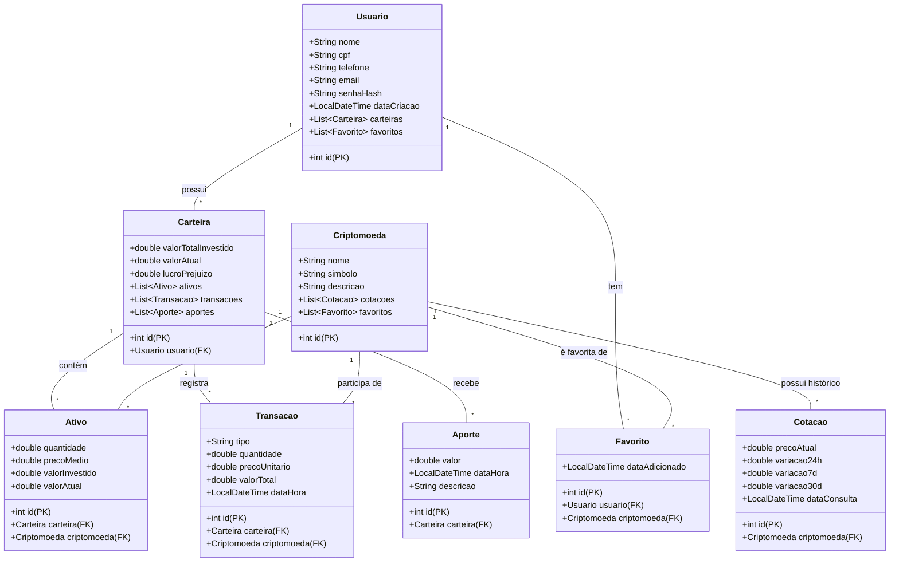

# Documentação do Projeto - Sprint 3 - Tio Patinhas

Este documento detalha as melhorias realizadas no modelo de dados do projeto, incluindo a implementação de relações One-to-Many e Many-to-Many, definição de PKs/FKs e diagramação das classes.

## 1. Mudanças Realizadas

### Entidades Associativas (Many-to-Many)
- **Ativo**: Atua como entidade associativa entre `Carteira` e `Criptomoeda`. Representa a posse de uma criptomoeda específica em uma carteira.
- **Favorito**: Nova entidade criada para representar a relação Many-to-Many entre `Usuario` e `Criptomoeda`. Permite que um usuário siga várias criptomoedas e uma criptomoeda seja seguida por vários usuários.

### Relações One-to-Many
- **Usuario -> Carteira**: Refatorado para permitir que um usuário possua múltiplas carteiras.
- **Carteira -> Transacao**: Uma carteira possui um histórico de transações.
- **Carteira -> Aporte**: Uma carteira possui múltiplos aportes de capital.
- **Criptomoeda -> Cotacao**: Uma criptomoeda possui várias cotações históricas.
- **Criptomoeda -> Transacao**: Uma criptomoeda pode estar presente em múltiplas transações.

## 2. Definição de Atributos, PKs e FKs

| Classe | Atributo | Tipo | Restrição | Descrição |
| :--- | :--- | :--- | :--- | :--- |
| **Usuario** | id | int | PK | Identificador único do usuário |
| | nome | String | | Nome completo |
| | email | String | | Email (Unique) |
| **Carteira** | id | int | PK | Identificador único da carteira |
| | usuario | Usuario | FK | Referência ao dono da carteira |
| **Criptomoeda**| id | int | PK | Identificador único da cripto |
| | simbolo | String | | Ex: BTC, ETH |
| **Ativo** | id | int | PK | Identificador único do saldo |
| | carteira | Carteira | FK | Carteira que possui o ativo |
| | criptomoeda| Criptomoeda| FK | Criptomoeda possuída |
| **Favorito** | id | int | PK | Identificador único do favorito |
| | usuario | Usuario | FK | Usuário que favoritou |
| | criptomoeda| Criptomoeda| FK | Criptomoeda favoritada |
| **Transacao** | id | int | PK | Identificador da transação |
| | carteira | Carteira | FK | Carteira envolvida |
| | criptomoeda| Criptomoeda| FK | Criptomoeda negociada |
| **Cotacao** | id | int | PK | Identificador da cotação |
| | criptomoeda| Criptomoeda| FK | Criptomoeda da cotação |
| **Aporte** | id | int | PK | Identificador do aporte |
| | carteira | Carteira | FK | Carteira que recebeu o aporte |

## 3. Diagrama de Classes (Mermaid)

> **Nota:** O diagrama acima utiliza a sintaxe Mermaid. Ele pode ser visualizado diretamente no GitHub ou em editores como VS Code com extensões apropriadas, e exportado para PNG ou PDF conforme solicitado.
